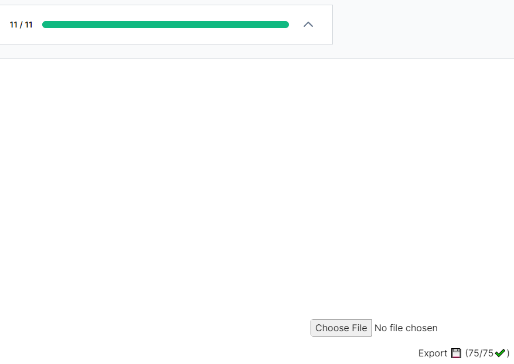

# TechInterviewHandbook - Grind75 import and export

Import and export tool for [Grind75 of TechInterviewHandbook.org](https://www.techinterviewhandbook.org/grind75)



## Import

Importing the file will update the **completed** questions and update the URL to include the stored preferences.

## Export

Clicking the **export** button will download a `JSON` file with the following information:

```json
{
  "meta": {
    "total": 75,
    "url": "https://www.techinterviewhandbook.org/grind75?topics=array&topics=stack&topics=linked-list&topics=string&topics=binary-tree&topics=binary-search&topics=graph&topics=binary-search-tree&topics=heap&topics=hash-table&topics=trie&topics=recursion&topics=matrix&topics=math&topics=queue&topics=dynamic-programming&topics=binary&mode=preferences&order=all_rounded&grouping=weeks&difficulty=Easy&difficulty=Medium&difficulty=Hard&weeks=8&hours=8#"
  },
  "completed": [
    "two-sum",
    "valid-palindrome",
    "valid-anagram",
    "best-time-to-buy-and-sell-stock",
    "valid-parentheses",
    "group-anagrams",
    "merge-two-sorted-lists",
    "invert-binary-tree",
    "binary-search",
    "flood-fill",
    "lowest-common-ancestor-of-a-binary-search-tree",
    "balanced-binary-tree",
    "linked-list-cycle",
    "ransom-note",
    "first-bad-version",
    "implement-queue-using-stacks",
    "reverse-linked-list",
    "majority-element",
    "add-binary",
    "longest-palindrome",
    "middle-of-the-linked-list",
    "climbing-stairs",
    "lowest-common-ancestor-of-a-binary-tree",
    "diameter-of-binary-tree",
    "maximum-subarray",
    "binary-tree-level-order-traversal",
    "insert-interval",
    "maximum-depth-of-binary-tree",
    "search-in-rotated-sorted-array",
    "validate-binary-search-tree",
    "kth-smallest-element-in-a-bst",
    "sort-colors",
    "k-closest-points-to-origin",
    "longest-substring-without-repeating-characters",
    "3sum",
    "01-matrix",
    "clone-graph",
    "evaluate-reverse-polish-notation",
    "course-schedule",
    "implement-trie-prefix-tree",
    "min-stack",
    "coin-change",
    "product-of-array-except-self",
    "number-of-islands",
    "rotting-oranges",
    "combination-sum",
    "permutations",
    "merge-intervals",
    "time-based-key-value-store",
    "minimum-window-substring",
    "merge-k-sorted-lists",
    "serialize-and-deserialize-binary-tree",
    "trapping-rain-water",
    "find-median-from-data-stream",
    "accounts-merge",
    "binary-tree-right-side-view",
    "subsets",
    "spiral-matrix",
    "word-break",
    "partition-equal-subset-sum",
    "string-to-integer-atoi",
    "longest-palindromic-substring",
    "unique-paths",
    "construct-binary-tree-from-preorder-and-inorder-traversal",
    "container-with-most-water",
    "word-search",
    "letter-combinations-of-a-phone-number",
    "find-all-anagrams-in-a-string",
    "task-scheduler",
    "lru-cache",
    "minimum-height-trees",
    "largest-rectangle-in-histogram",
    "word-ladder",
    "basic-calculator",
    "maximum-profit-in-job-scheduling",
    "contains-duplicate"
  ]
}
```

